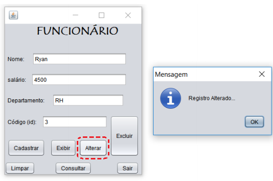

<h1>Interface - Java - Banco de Dados (MySql)</h1>

Contruction an project CRUD in Java with connection in MySql.

<h2>Why?</h2>

It was a file of school (end) and close for here with more details.  
Using knows generals and complement things:  
ArrayList<String> Funcionarios = new ArrayList();  
POO somewhat Functional Struture Simple  
Made in base Sql -follow- USB Serve (local)

By RYAN CASTRO FERREIRA, 
<b style="color: blue;">LinkdIn </b>- https://www.linkedin.com/in/ryan-castro-ferreira/  
<b style="color: red;">Email </b>- ryancasf@gmail.com  

<h2>Attention</h2>

<h3>Help informations</h3>  
localhost:3307  
driverName = "com.mysql.jdbc.Driver"  
useTimezone=true&serverTimezone=UTC&useSSL=false"

<h3>Dev - MySql:</h3>

Without application specific Serve because is small code, so coy there:

<pre>
CREATE DATABASE Empresa;

create table Funcionarios (
	id int auto_increment,
 	nome_funcionario varchar(64),
 	salario_funcionario float,
 	departamento_funcionario varchar(32),
 	primary key(id)
);

* seconds commands:
USE Empresa;
SELECT * FROM Funcionarios;
</pre>

<h2>Built </h2>

.

<video width="320" height="240"><source src="img/videoProjetoFinalJava.avi" type="video/avi"></video>